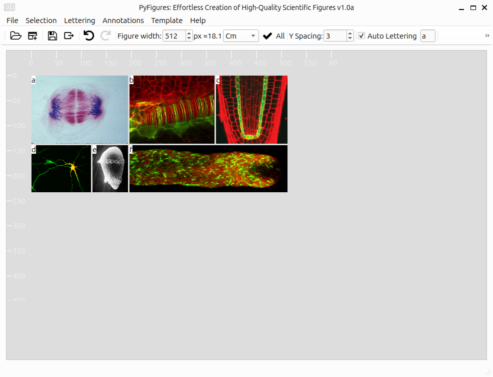

# PyFigures

Effortless creation of high-quality scientific figures in Python. 

[](https://youtu.be/HSdCu-CW8eI)

Since a video is better than a thousand (click on the image above to view the demo).

# Install

1. Install [Miniconda](https://docs.anaconda.com/miniconda/) (if not already present on your system)

2. Then in a command prompt type: 

```
conda create -y -n PyFigures python==3.10.12
conda activate PyFigures
pip install -U pip
pip install -U pyfigures
python -m pyfigures
```

**NB**:
- To open a **command prompt** on **Windows** press **Windows+R** then type **cmd**
- To open a **command prompt** on **MacOS** press **Command+Space** then type **Terminal**
- To open a **command prompt** on **Ubuntu** press **Ctrl+Alt+T**

# Run

To open the graphical user interface, type the following in a command:

 ```
conda activate PyFigures
python -m pyfigures
 ```
   
# Third party libraries

Below is a list of the 3<sup>rd</sup> party libraries used by PyFigures.<br><br> <font color='red'>**IMPORTANTLY: if you disagree with any license below, <u>please uninstall PyFigures</u>**.<br></font>

| Library name            | Use                                                         | Link                                          | License            |
|-------------------------|-------------------------------------------------------------|-----------------------------------------------|--------------------|
| **Markdown**            | Python implementation of Markdown                           | https://pypi.org/project/Markdown/            | BSD                |
| **matplotlib**          | Plots images and graphs                                     | https://pypi.org/project/matplotlib/          | PSF                |
| **numpy**               | Array/Image computing                                       | https://pypi.org/project/numpy/               | BSD                |
| **Pillow**              | Reads 'basic' images (.bmp, .png, .pnm, ...)                | https://pypi.org/project/Pillow/              | HPND               |
| **PyQt6**               | Graphical user interface (GUI)                              | https://pypi.org/project/PyQt6/               | GPL v3             |
| **QtPy**               | An abstraction layer for PyQt and PySide                    | https://pypi.org/project/QtPy/               | MIT             |
| **read-lif**            | Reads Leica .lif files                                      | https://pypi.org/project/read-lif/            | GPL v3             |
| **czifile**             | Reads Zeiss .czi files                                      | https://pypi.org/project/czifile/             | BSD (BSD-3-Clause) |
| **tifffile**            | Reads .tiff files (also reads Zeiss .lsm files)             | https://pypi.org/project/tifffile/            | BSD                |
| **python-bioformats**               | A library to open scientific images                         | https://pypi.org/project/python-bioformats/               | GPLv2                |
| **python-javabridge**               | A library to run java executables (required for bioformats) | https://pypi.org/project/python-javabridge/               | BSD                |
| **scikit-image**        | Image processing                                            | https://pypi.org/project/scikit-image/        | BSD (Modified BSD) |
| **scipy**               | Great library to work with numpy arrays                     | https://pypi.org/project/scipy/               | BSD                | 
| **scikit-learn**               | Great library for machine learning                          | https://pypi.org/project/scikit-learn/               | BSD                | 
| **tqdm**                | Command line progress                                       | https://pypi.org/project/tqdm/                | MIT, MPL 2.0       |
| **natsort**             | 'Human' like sorting of strings                             | https://pypi.org/project/natsort/             | MIT                |
| **numexpr**             | Speeds up image math                                        | https://pypi.org/project/numexpr/             | MIT                |
| **urllib3**             | Model architecture and trained models download              | https://pypi.org/project/urllib3/             | MIT                |
| **qtawesome**           | Elegant icons for PyQT/PySide                                       | https://pypi.org/project/QtAwesome/           | MIT                |
| **pandas**              | Data analysis toolkit                                       | https://pypi.org/project/pandas/              | BSD (BSD-3-Clause) |
| **numba**               | GPU acceleration of numpy ops                               | https://pypi.org/project/numba/               | BSD                |
| **roifile**               | A library to read ImageJ ROIs                               | https://pypi.org/project/roifile/               | BSD 3-Clause                |

